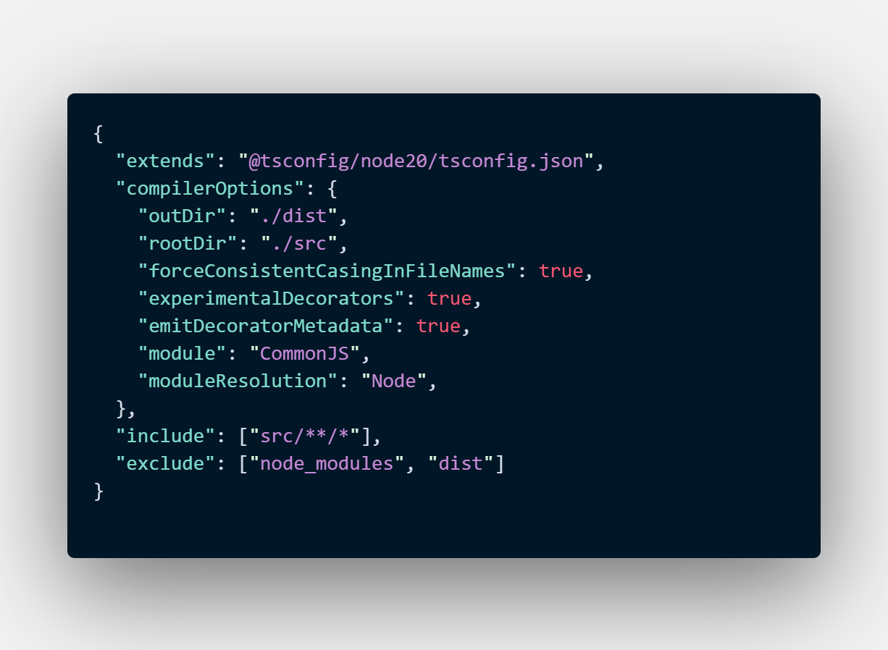

### Create environment files
2 Environment files should be created. They will be named `.env` and `.env.production`, and should be placed in the root directory of the project.

### Notes
1. In ES Lint Unused vars are off.
2. For different configurations check out the available branches in the git.
3. The logging option for the DB request queries are off by default, you can change it by changing the value in `db-connection.ts`

### Switch to CommonJS
If CommonJS is requried for the project, then -> 2 values from the extended default node20 config will have to be changed. We can override them in the `tsconfig.json` and add the following lines at the end.
```json
    "module": "CommonJS",
    "moduleResolution": "Node",
```
The output should look something like this



### Create migration command example
```npm
npm run create-migration -- --name <name>
```